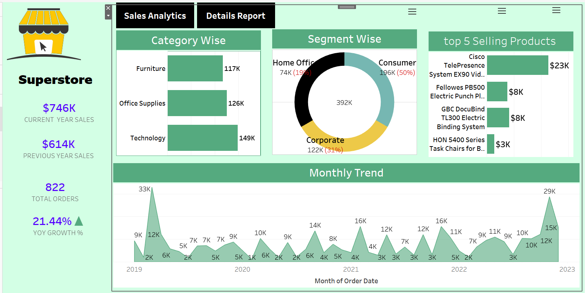

# Superstore Sales Analysis Dashboard

An interactive Tableau dashboard analyzing sales performance for a retail superstore — built to give a quick, visual read on revenue, growth, and product performance across categories and segments.

## 📊 Overview

This dashboard turns superstore transaction data into a clear sales story: how much was sold, how it compares year-over-year, which categories and segments drive revenue, and which products are the top performers — all in one interactive view.

## 🔑 Key Metrics Tracked

- **Current vs. Previous Year Sales** — tracks total revenue year-over-year to measure overall business growth
- **YoY Growth %** — highlights the percentage change in sales, making performance trends immediately visible
- **Total Orders** — gives a quick pulse on order volume alongside revenue
- **Category Wise Sales** — compares performance across Furniture, Office Supplies, and Technology
- **Segment Wise Sales** — breaks revenue down by Consumer, Corporate, and Home Office segments
- **Top 5 Selling Products** — surfaces the best-performing SKUs by revenue
- **Monthly Trend** — visualizes sales fluctuations month-over-month from 2019 to 2023 to spot seasonality and spikes

## 🛠️ Tools Used

| Tool | Purpose |
|------|---------|
| **Tableau Public** | Dashboard design and interactive visualization |
| **Tableau Calculations** | KPI metrics (YoY growth, current vs. previous year sales) |
| **Data Prep** | Cleaning and structuring the superstore dataset |

## 🖼️ Dashboard Preview

---

*Built with Tableau Public.*
